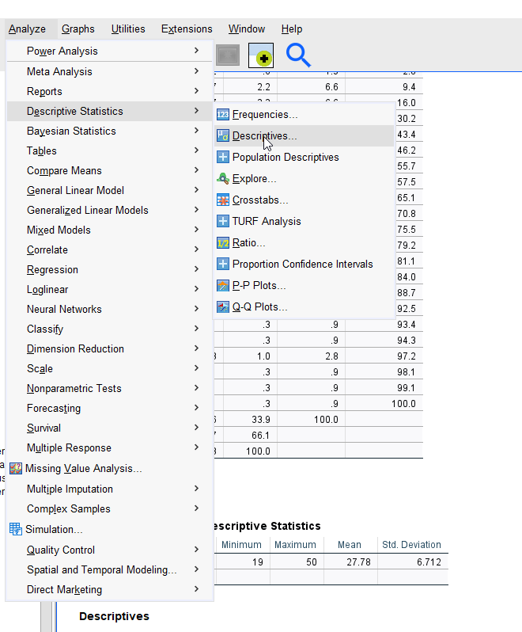

# Variable Alter
Erstellen Sie auf der Basis des Datensatzes DataLit eine neue Variable
Alter und berechnen Sie folgende Kennwerte:
* Modalwert
* Median
* Arithmetischer Mittelwert
* Spannweite
* Quartilsabstand
* Varianz
* Standardabweichung
* Schiefe
* Kurtosis
Überprüfen Sie zudem die Normalverteilungsannahme für diese neue Variable mithilfe
des Augenscheins über das Histogramm mit Linie und mit dem QQ-Plot.

## Erstellung der Variable Alter
In einem ersten Schritt muss das Geburtsjahr ermittelt werden
```
numeric GbJahr(f4).
variable label GbJahr "Geburtsjahr".

recode H007 
("A21"=2002)
("A22"=2001)
("A23"=2000)
("A24"=1999)
("A25"=1998)
("A26"=1997)
("A27"=1996)
("A28"=1995)
("A29"=1994)
("A30"=1993)
("A31"=1992)
("A32"=1991)
("A33"=1990)
("A34"=1989)
("A35"=1988)
("A36"=1987)
("A38"=1985)
("A39"=1984)
("A43"=1980)
("A49"=1974)
("A50"=1973)
("A51"=1972)
("A52"=1971)
into GbJahr.
```

Anchliessend kann aufgrund des Geburtsjahr das Alter berechnet werden
```
numeric alter(f2).
variable label alter "Alter".
compute alter=2021-GbJahr.
fre alter.
des alter.
```

## Modalwert
Der Modalwert ist jener Wert, welcher am häufigsten vorkommt und kann daher aus der frequency Tabelle (welche mit fre alter.) erzeugt wurde herausgelesen werden.


## Median
Median ist derjenige Wert unter und über dem gleich viele Fälle liegen. Der Median teilt somit die Messreihen in die oberen und unteren 50% auf. Dies kann ebenfalls aus der freuency Tabelle aufgrund der kummulierten Prozente herausgelesen werden.


## Arithmetische Mittelwert
Der arithmetische Mittelwert kann aus der deskriptiven Tabelle herausgelesen werden, welche mit dem Befehl (des alter.) erzeugt wurde.


## Spannweite
Die Spannweite ist die Differenz wischen des Minimum und Maximum Wertes, d.h 50 - 19 = 31 (siehe deskriptive Tabelle).

## Quartilsabstand
Die Messwerte werden grundsätzlich in 4 Quartile (Q1-Q4) eingeteilt (25% Blöcke). Der Quartilsabstand berechnet sich aus der Differenz zwischen dem 3. und 1. Quartil (75% - 25%), d.h liegt im Quartilsabstand 50% der Fälle. Die Quartile können anhand der Frequenz Tabelle bestimmt werden. Der Quartilsabstand ist daher 30 - 22 = 8.

## Varianz
Die Varianz ist die Summer der Abweichungsquadrate zum Mittelwert geteilt durch die Anzahl der Fälle. Über SPSS kann die Varianz über das Analyze Menü > Descriptive Statistics > Descriptives berechnet werden


Anschliessend muss die Variable (hier Alter) ausgewählt werden und dann kann über Optionen die Varianz aktiviert werden.


Anschliessend kann die Varianz leicht abgelesen werden (in diesem Falle 45).


## Standardabweichung
Die Standardabweichung kann einfach über die Deskriptive Tabelle, welche mit dem Befehl desc alter. erzeugt wurde abgelesen werden. In diesem Falle ist sie 6.71.


## Schiefe und Kurtosis berechnen
Schiefe und Kurtosis kann ebenfalls mit Hilfe des Menüpunktes Analyze > Descriptive Statistics > Descriptives berechnet werden.

Anschliessend kann über das Option Menü die Kurtosis sowie die Schiefe ausgewählt werden.

In diesem Falle beträgt die Kurtosis 2.6 und die Schiefe 1.6.


## Histogram
Ein Histogram kann über den Menüpunkt Analyze > Descriptive Statistics > Frequencies erstellt werden.

Hierzu muss wieder die Variable Alter ausgewählt werden und anschliessend unter Charts das Histogramm sowie die Option zur Einblendung einer Normalkurve ausgewählt werden.


## Q-Q Plot erstellen
Um einen Q-Q Plot zu erstellen kann wieder  das Analyze > Descriptive Statistics > Q-Q Plots Menü genutzt werden. 

Anschliessend muss nur noch die entsprechende Variable ausgewählt werden.


# Berechnung von z-Werten
Auf der Grundlage von Daten aus einer Schweizer Schulererhebung wird aus verschiedenen Variablen (z.B. Angaben zum Beruf der Eltern, zur Elternausbildung sowie zur
Anzahl von Buchern zu Hause) ein Index zur sozialen Herkunft erstellt. Dieser Index
erscheint in einer neu gebildeten numerischen Variable im Datensatz, gibt also für jeden
Fall in diesem Datensatz einen Skalenwert zur sozialen Herkunft an. Die neu gebildete
Skala läuft von 0 (Wert mit der geringsten Ausprägung) bis 10 (Wert mit der höchsten
Ausprägung).
Für die gesamte Schweiz liegt der arithmetische Mittelwert auf dieser Skala bei 5.6 und die Standardabweichung beträgt 1.8 (Zahlen sind von mir frei erfunden!). Die Verteilung entspricht einer Normalverteilung. Der Mittelwert der Verteilung der Bundner Schülerinnen und Sch üler liegt etwas tiefer als in der Gesamtschweiz, nämlich bei 5.1 mit einer Standardabweichung von 2.

### Berechnung Z-Wert
Der Z-Wert wird mittels folgender Formel errechnet
```
z = (x - arithmetischer Mittelwert) / Standardabweichung
```


## Aufgabenstellung
Wo in der Verteilung der Schweiz liegt der Bündner Mittelwert, bzw. wie viele  Schweizer Schülerinnen und Schüler haben bzgl. der sozialen Herkunft einen tieferen Wert als die oder der typische Bündner Schülerin bzw. Schüler?

```
z = [5.1 (Bündner Mittelwert) - 5.6 (arithmetischer Mittelwert)] / 1.8 (Standarabweichung) = -0.278
```
Um den zweiten Teil der Frage herauszufinden (Wie viele Schülerinnen und Schüler einen tieferen Wert haben) muss der Z-Wert (-0.278) in eine z-Tabelle eingesetzt werden. Hierbei muss auf die **Nachkommastellen** geachtet werden. Der Teil 1 bei der Z-Wertetabelle betrifft die **erste Nachkommastelle**, der Teil 2 die **zweite Nachkommastelle**. Somit ergibt sich für den Wert -0.278 eine Fläche von 39.4%. Anders ausgedrückt haben 39.4% einen Wert der tiefer liegt als der Mittelwert. Für die Ermittlung wurde folgende Z-Tabelle genommen [Z-Werte Tabelle](http://eswf.uni-koeln.de/glossar/zvert.htm).


